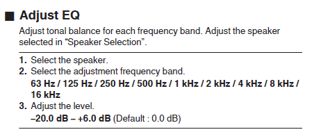
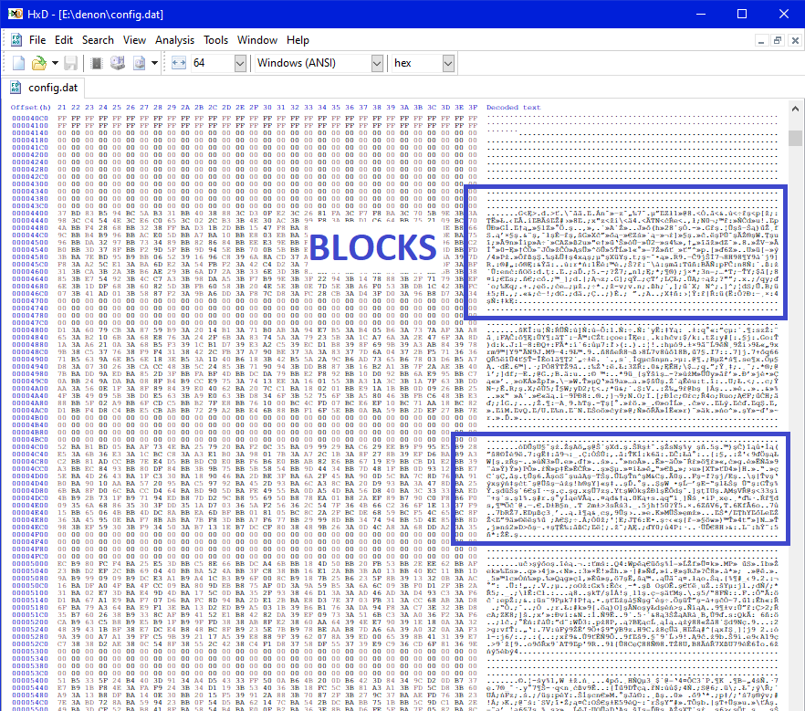
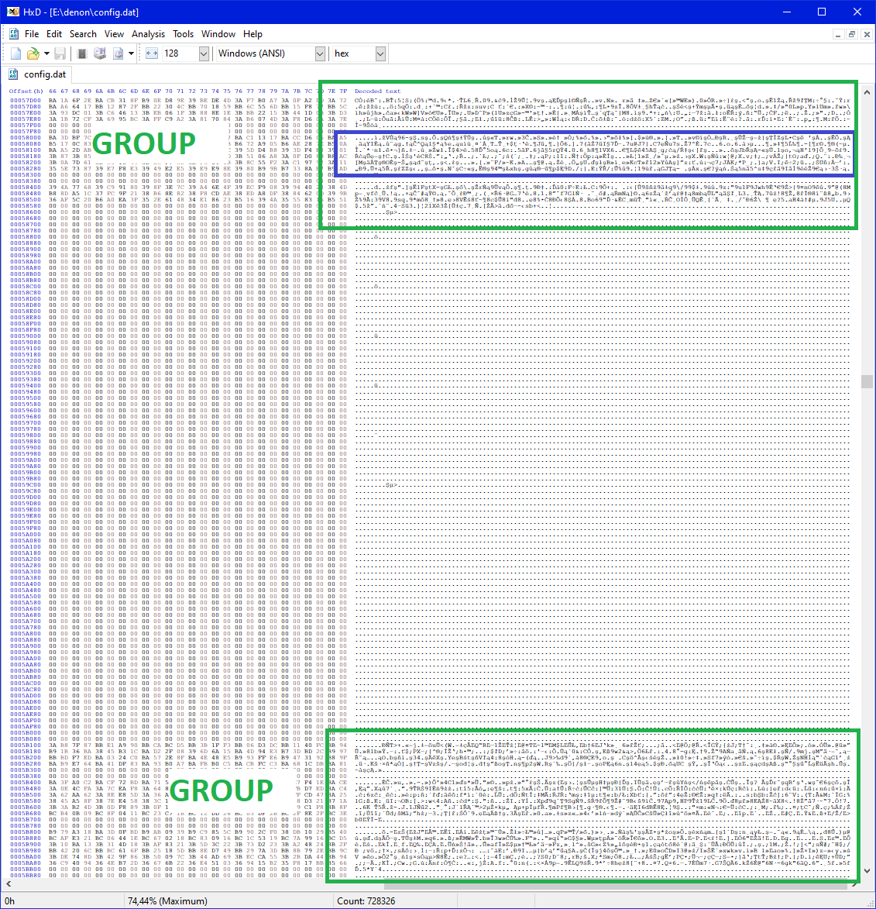
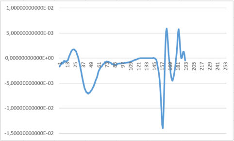
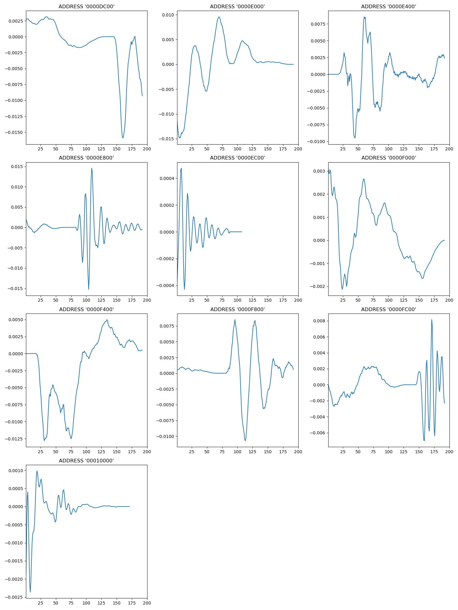

# Audyssey-From-config_dat
extracting Audyssey info from saved config.dat, for older Denon AVR

(translated with help of Copilot) 
I recently bought a slightly older used Denon AVR and started looking for information on how to best configure it.

I found very interesting guides on the Obsessive Compulsive Audiophile YouTube channel (https://www.youtube.com/@ocaudiophile). 

There were instructions for amplifiers like mine, which use a nine band graphic equalizer.

However, I found out that for newer devices there is an even better mechanism using the MULTEQ Editor app, unfortunately my amplifier is not compatible with this application.

Then one day I realized that my amplifier has Audyssey MULTEQ XT32 data, which seems to be much more accurate than the 9 bands available in "Adjust EQ"!

It shows very detailed information about the correction applied for each speaker.

Data with a horizontal resolution of at least 61 values.

If I can view such precise Audyssey settings, then this data should also be found in the configuration backup that can be downloaded from the amplifier, in the "config.dat" file!

I downloaded "config.dat" file and started examining it. 
I noticed that you can easily see very dense binary areas which I called blocks; 

Then I noticed that these blocks occur in groups, I’m not sure if these groups have any significance.

I started looking at these blocks, first there was a block address and then binary data which seemed to make sense when treated as little endian double word float.

Most blocks have a length of 192 floats, but there are also other lengths, 43, 107, 171.

I checked a few blocks manually by transferring data to Excel and was pleasantly surprised, 
these data look like time courses or power characteristics in the frequency domain or time, 
however, I was surprised that the calculated values are so tiny, far from the sought values from -20 to 6 db.

Because I wanted to process a lot of information in a specific way, I started writing a script in Python.

The first version, "config_blocks_to_CVSs", finds sensible blocks and saves them to CSV files.

The second script, "Groups_to_CSV_with_visualisation", collects information from all groups and blocks into one structure, records it on the disk, 
and then generates blocks charts for each group separately. 

There are 18 groups, and 314 sensible blocks found, 
these are data extracted from config.dat for my 7.1.2 configuration.

The charts really look like some measurements or correction curves, but none of them resemble the filters shown by the OSD. 
How do these data relate to what the MULTEQ Editor App saves in "*.ady" files?

Why are there so many blocks, there are readings, but for what X-axis values?

Some look like theoretical target curves.

A certain set of blocks may be calibration data for the microphone.

But which block is which and how are they connected?

# Conclusion
I can’t understand these data, 
but if I understood them, it seems that there is a chance that they could be changed based on calculations from REW and try to load them into the amplifier.
